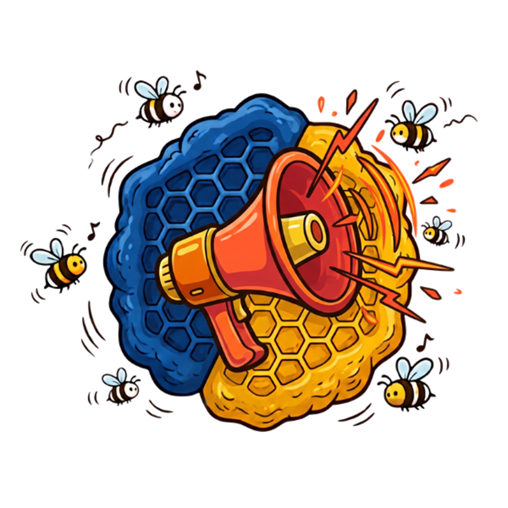

<p align="center"></p>

# HiveBuzz

App de escritorio **gratuita e independiente** para streamers de TikTok LIVE: alertas, TTS,
overlays para OBS / TikTok LIVE Studio, chatbot, puntos y acciones automáticas.

Todo corre en la PC del streamer: sin servidor propio y sin costo de infraestructura. La conexión
a TikTok sale desde tu IP.

> Estado: **Fases 1 a 6** implementadas (sin Minecraft/RCON, descartado). Lo no verificado en vivo está en la sección
> «Pendiente / no verificado» de cada fase del
> [CHANGELOG.md](CHANGELOG.md).

## Arquitectura

```
Sidecar Node/TS ──NDJSON──▶ SidecarSource (LiveSource) ──▶ Bus de eventos ──┬─▶ UI (dashboard)
 (tiktok-live-connector     supervisado y reiniciado      (tokio::broadcast) ├─▶ Servidor local WS ─▶ overlays
  + normalizador)                                                            └─▶ Log SQLite (7 días)
```

| Carpeta | Contenido |
|---|---|
| `src/` | UI: React + Vite + TypeScript (strict) + Tailwind + i18n (es) |
| `src-tauri/` | Backend Rust (Tauri 2): bus, conexión, SQLite, servidor axum, secretos, simulador |
| `sidecar/` | Conector TikTok en TypeScript: normalizador, supervisor de conexión y tests |
| `overlays/` | Páginas de overlay independientes (HTML), servidas por el servidor local |

Piezas clave:

- **`LiveSource`** (`src-tauri/src/source/mod.rs`): el resto de la app no sabe que existe un sidecar.
  Cambiar de librería o de proveedor de firma no toca el núcleo.
- **Normalizador** (`sidecar/src/normalizer.ts`): deduplicación por `msgId` (LRU de 10 000), rachas
  de regalos combinables (solo con `repeatEnd`), regalos grandes no combinables emitidos al primer
  mensaje, likes agregados en ventanas de 1 s, y log de lo desconocido sin tirar la app.
- **Resiliencia** (`sidecar/src/connector.ts`): espera al LIVE, backoff exponencial con jitter
  (1 s → 60 s), heartbeat de 45 s, y reinicio automático del sidecar desde Rust.

## Requisitos

- [Rust](https://rustup.rs) (stable) y las [dependencias de Tauri 2](https://v2.tauri.app/start/prerequisites/)
- [Bun](https://bun.sh) ≥ 1.1 (gestor de paquetes y compilador del sidecar)
- Windows 11 es la plataforma principal; macOS y Linux deben compilar.

## Desarrollo

```powershell
bun install
bun --cwd sidecar install
bun run sidecar:build     # compila el sidecar -> src-tauri/binaries/tiktok-sidecar-<triple>[.exe]
bun run tauri dev
```

> Cierra HiveBuzz antes de recompilar: Windows no deja sobrescribir `tiktok-sidecar.exe` mientras
> la app lo tiene en ejecución (`tauri-build` falla con «Acceso denegado»).

Al cambiar el código del sidecar hay que volver a ejecutar `bun run sidecar:build`: la app usa el
binario compilado, no el código fuente.

### Pruebas y verificación

```powershell
bun run test          # sidecar (vitest) + overlays (vitest + jsdom) + Rust (cargo test)
bun run typecheck     # TypeScript estricto: UI, tests de overlays y sidecar
cargo clippy --manifest-path src-tauri/Cargo.toml --all-targets -- -D warnings
```

Sin estar en vivo puedes probar todo con el **simulador** del panel (regalos combinables y grandes,
chat, likes, follows, shares, suscripciones, entradas y una ráfaga de 20 eventos).

## Compilar con tu entorno (`.env`)

Todo lo que cambia de una máquina a otra va en un archivo `.env` (ignorado por Git):

1. `copy .env.example .env` y rellénalo (el archivo explica cada variable).
2. `bun run app:check` → comprueba que el entorno está bien.
3. `bun run app:dev` → modo desarrollo. `bun run app:build` → instalador.

| Variable | Para qué | Obligatoria |
|---|---|---|
| `HIVEBUZZ_SPOTIFY_CLIENT_ID` | Client ID de tu app de Spotify (botón «Conectar» para todos) | No (sin ella, Spotify queda desactivado) |
| `HIVEBUZZ_TWITCH_CLIENT_ID` | Client ID de tu app de Twitch (botón «Entrar con Twitch») | No (el chat de Twitch funciona sin él) |
| `TAURI_SIGNING_PRIVATE_KEY_PATH` / `_PASSWORD` | Firma de las actualizaciones automáticas | Solo si publicas releases |

Lo que ya esté definido en el entorno (p. ej. en CI) manda sobre el `.env`. Si cambias el Client ID se recompila solo.
La clave **pública** del updater va en `src-tauri/tauri.conf.json` (`plugins.updater.pubkey`).

> Para probar sin tocar tus datos reales: `HIVEBUZZ_DATA_DIR=<carpeta>` hace que la app use esa carpeta (base de datos, sonidos, medios).

## Marca, tutorial y ayuda

- **Colores:** azul `#00346e`, amarillo `#ffc113` y naranja `#f94a20` (definidos una sola vez en `src/index.css`; en los overlays, `overlays/common.css`).
- **Logo:** `public/hivebuzz.png` es el original; `public/logo.png` es el mismo con fondo transparente (1024 px) y de él salen los iconos de la app
  (`bunx tauri icon public/logo.png` regenera todos los de `src-tauri/icons`, incluidos Windows, macOS y Linux).
- **Recorrido interactivo:** una invitación aparece la primera vez en Inicio; también está en *Ayuda → Empezar recorrido*. Oscurece la pantalla, resalta cada parte,
  explica qué es y en dos pasos espera a que la persona lo haga de verdad (probar el simulador, abrir Reglas). Se maneja con el ratón o con las teclas ← → y Esc.
  Los pasos están en `src/lib/tour.ts`; sus textos, en `tour.*` de `es.json`/`en.json`.
- **Ayuda** (en el menú): qué hay en cada parte del menú, glosario y preguntas frecuentes. Los tests comprueban que cada pantalla del menú esté explicada en ambos idiomas.

## Twitch (Fase 7)

HiveBuzz lee **TikTok y Twitch a la vez**. En *Inicio* hay una tarjeta por plataforma.

- **Sin cuenta:** escribe el nombre de tu canal y pulsa *Conectar*. Se lee el chat, los **bits** (llegan como regalos «Bits»)
  y las **suscripciones** por el IRC anónimo de Twitch (no se envía ninguna credencial).
- **Con cuenta (opcional):** *Entrar con Twitch* muestra un código para escribir en `twitch.tv/activate` (sin contraseñas en HiveBuzz,
  sin redirecciones). Añade **seguidores nuevos**, saber si estás **en directo** y cuántos te ven. Solo funciona si el canal conectado es el de la cuenta.
  Se pide un único permiso (`moderator:read:followers`); el token se guarda en el llavero del sistema.
- **Solo lectura:** el bot, `!sr` y los agradecimientos **no escriben en Twitch** (siguen respondiendo solo en TikTok). Los puntos, las reglas, el TTS,
  las alertas, los overlays y los votos de las encuestas sí funcionan con los espectadores de Twitch.
- **Identidad:** los ids de Twitch llevan el prefijo `tw:` (no chocan con los de TikTok); no hay migración de base de datos.
  `is_follower` y los niveles de equipo/donador no existen en Twitch (siempre falsos/ausentes). Raids, puntos de canal y hype train no se leen todavía.
- Los overlays de chat, feed y regalos tienen la opción *Mostrar de qué plataforma viene*; en Twitch los regalos se muestran en **bits**.
- **Resiliencia:** reconexión automática con backoff (1 s → 60 s con jitter), mensajes reenviados descartados por id, y reconexión si no llega ni un PING en 6 minutos.
- **Interfaz:** menú lateral agrupado, pantalla de Inicio con tarjetas de conexión, lista de primeros pasos y simulador plegado (con selector de plataforma).

## Compilar con un solo comando

| Sistema | Comando |
|---|---|
| Windows | `scriptsuild.cmd` (o `.scriptsuild.ps1`) |
| Linux y macOS | `./scripts/build.sh` |

Hacen todo: comprueban las herramientas (Bun, Rust, Visual Studio C++ / bibliotecas de Linux / Xcode), instalan dependencias, validan el `.env`, compilan
y dejan los instaladores con su suma SHA-256 en `release/<versión>/`. Opciones: `-Updater` / `--updater` (archivos firmados del auto-update; necesita la clave
privada del `.env`), `-SkipInstall` / `--skip-install` y `-DryRun` / `--dry-run` (solo comprueba el entorno). Cada sistema compila **solo para sí mismo**:
para las cuatro plataformas a la vez usa el flujo de GitHub (abajo).

## Distribución (Windows, macOS y Linux)

| Plataforma | Qué se genera | Target del sidecar |
|---|---|---|
| Windows 10/11 | instalador NSIS (`.exe`) y `.msi` | `x86_64-pc-windows-msvc` |
| macOS (Apple Silicon) | `.dmg` / `.app` | `aarch64-apple-darwin` |
| macOS (Intel) | `.dmg` / `.app` | `x86_64-apple-darwin` |
| Linux | `.AppImage` y `.deb` | `x86_64-unknown-linux-gnu` |

- **Publicar una versión:** `bun scripts/set-version.mjs 0.2.0` (cambia package.json, tauri.conf.json y Cargo.toml a la vez;
  `--show` comprueba que coinciden), commit, `git tag v0.2.0` y `git push --tags`. `.github/workflows/release.yml` compila las
  4 plataformas en paralelo (cada una con su sidecar nativo) y deja un **borrador** de release con instaladores y `latest.json`.
- `.github/workflows/ci.yml` ejecuta tipos, build, tests y clippy en las tres plataformas en cada push.
- **Linux, dependencias de compilación (Ubuntu/Debian):** `libwebkit2gtk-4.1-dev libappindicator3-dev librsvg2-dev patchelf
  libasound2-dev libdbus-1-dev libssl-dev pkg-config`.
- **macOS:** sin certificado de Apple los usuarios verán el aviso de «desarrollador no identificado» (clic derecho → Abrir). Para
  firmar y notarizar añade los secretos `APPLE_*` indicados en `release.yml`.
- **Diferencias por plataforma:** las teclas simuladas (`pressKeys`) y las voces del sistema (SAPI) son solo de Windows; en macOS/Linux
  esas opciones avisan de que no están disponibles. Piper se instala solo en Windows (en los demás se indica la ruta a mano).
  Los secretos usan Credential Manager / Llavero de macOS / Secret Service (necesita GNOME Keyring o KWallet en Linux).
- **No verificado:** solo se ha compilado y probado en Windows. Las otras plataformas dependen de que el primer CI pase.

## Empaquetado

```powershell
bun run tauri build
```

`beforeBuildCommand` compila primero el sidecar con Bun (`bun build --compile`, binario único con el
runtime incluido, ~90 MB) y lo declara como `externalBin` de Tauri. El script
`sidecar/scripts/build.mjs` detecta el *target triple* con `rustc -vV` (o `TAURI_ENV_TARGET_TRIPLE`)
y soporta Windows, Linux y macOS (x64/arm64).

## Overlays y servidor local

El servidor escucha **solo en `127.0.0.1`** (puerto por defecto **17890**, configurable en Ajustes;
el cambio se aplica al reiniciar). En *Ajustes → Overlays* están las URLs listas para copiar:

```
http://127.0.0.1:17890/overlay/feed?token=<TOKEN>
```

Pégalas como **Browser Source** en OBS o TikTok LIVE Studio.

Seguridad del servidor local:

- Toda petición exige el token (`?token=`), comparado en tiempo constante. Se genera al primer
  arranque (256 bits) y vive en el llavero del sistema.
- Se rechaza cualquier `Host` no local (anti DNS-rebinding) y cualquier `Origin` que no sea local
  (anti páginas web de terceros).
- Los overlays insertan el texto de TikTok con `textContent`, nunca como HTML.

### WebSocket local

`ws://127.0.0.1:<puerto>/ws?token=<TOKEN>` emite JSON por mensaje:

```json
{"type":"hello","version":1}
{"type":"event","event":{ "id":"…","type":"gift","user":{…},"gift":{…},"ts":1700000000000 }}
{"type":"lagged","missed":12}
```

`gift.coins` es el valor **total** del regalo (monedas por unidad × cantidad).

## Overlays (Fase 3)

Cada overlay es una página independiente con su URL (se copian desde *Overlays* o *Ajustes*):

| Overlay | URL | Muestra |
|---|---|---|
| Alertas | `/overlay/alerts` | Imagen/GIF/video + texto de las acciones `overlayAlert`, de una en una |
| Feed de eventos | `/overlay/feed` | Chat, regalos, follows, shares y suscripciones |
| Chat | `/overlay/chat` | Chat en pantalla (insignias, emotes, filtros) |
| Regalos | `/overlay/gifts` | Regalos recientes con su imagen |
| Top donadores | `/overlay/leaderboard` | Ranking de la sesión, del día o histórico |
| Metas | `/overlay/goals` | Barras de progreso |
| Timer | `/overlay/timer` | Cuenta regresiva / subathon |
| Contadores | `/overlay/counters` | Likes y espectadores |

Todas llevan `?token=…`. Añade `&lang=en` para otro idioma de los textos (cuando exista).

**Editor visual**: en la pestaña *Overlays* eliges un overlay, ves su **vista previa en vivo** (a
1920×1080) y ajustas fuente, colores, opacidad, posición, escala y comportamiento; los cambios llegan
al overlay sin recargar. «Probar» manda contenido de ejemplo a los overlays de eventos.

**Cómo funciona**: la configuración vive en SQLite y se publica *retenida* en `config:<id>`; las metas,
el timer, el ranking y los contadores también publican su último estado, así que un overlay recién
abierto (o refrescado en OBS) lo muestra al instante junto con los últimos eventos del chat.
El esquema de opciones de cada overlay está en `src-tauri/src/overlay_config/schema.rs` (un solo
lugar para valores por defecto, rangos, validación y etiquetas); para añadir una opción basta con
declararla ahí y leerla en la página del overlay.

**Metas y timers** (pestaña *Metas y timers*):

- *Metas*: likes, follows, shares, suscripciones, monedas o un regalo concreto. Al alcanzarse pueden
  quedarse completas, reiniciarse (conservando el sobrante) o subir el objetivo; disparan el trigger
  «Meta alcanzada» de las reglas.
- *Timers / subathon*: cuenta regresiva que se extiende por monedas, likes, follows, shares,
  suscripciones o un regalo concreto (con tope máximo). Sobrevive a reinicios y dispara «Timer terminado».
- Acciones de reglas para controlarlos: `goalAdjust` y `timerControl` (admiten `{coins}`, `{count}`…).
- *Sesión*: empieza sola al reconectar tras un fin de LIVE; reinicia el ranking de la sesión, los
  contadores y las metas con «empezar de cero en cada LIVE nuevo».

## Reglas y acciones (Fase 2)

Una **regla** es `trigger → condiciones → acciones`, guardada como JSON en SQLite y editable desde la
pestaña *Reglas* (con botón **Probar**). Ejemplo:

```json
{
  "id": "…", "name": "Gracias por la rosa", "enabled": true,
  "trigger": { "type": "gift", "giftName": "Rose", "minCoins": 1 },
  "conditions": { "userCooldownMs": 5000, "rolesAny": [], "probability": 100 },
  "plan": { "mode": "sequence", "steps": [
    { "delayMs": 0,   "action": { "type": "overlayAlert", "title": "{nickname}", "text": "envió {count}× {gift}", "imageUrl": "{giftimage}", "durationMs": 5000 } },
    { "delayMs": 300, "action": { "type": "tts", "text": "Gracias {nickname} por la {gift}" } }
  ]},
  "ttlMs": 60000
}
```

- **Variables** en los textos: `{user} {nickname} {gift} {count} {coins} {text} {args} {likes}`.
- **Cola**: prioridad automática por monedas (los regalos grandes se adelantan), un TTS a la vez,
  sonidos en paralelo, alertas de una en una, máximo 200 en espera, caducidad por regla y
  persistencia: lo pendiente se recupera al reabrir la app.
- **Agregar un ejecutor**: implementa `ActionExecutor` (`src-tauri/src/actions/mod.rs`), regístralo
  en `AppState::init` y, si quieres, añade su formulario en `src/components/rules/ActionParams.tsx`
  (mientras tanto la UI ofrece un editor JSON genérico). El núcleo no cambia.

### Sonidos, medios y alertas

*Biblioteca* importa sonidos (mp3/wav/ogg/flac) e imágenes/GIF/videos. Para mostrar las alertas
añade `…/overlay/alerts?token=…` como Browser Source (`&pos=top|center|bottom` cambia la posición).

### Voz (TTS)

- **Piper** (offline): *Voz (TTS) → Instalar Piper* descarga el motor (≈22 MB, verificado por SHA-256)
  y permite bajar voces (≈63 MB). En macOS/Linux instala Piper a mano y configura su ruta.
- **SAPI**: voces del sistema en Windows, sin descargas.
- **Edge-TTS** (opcional): servicio no oficial de Microsoft; si deja de responder, se actualiza la
  constante `CHROMIUM_VERSION` en `src-tauri/src/tts/edge.rs`.
- Todo texto leído (del chat o de una regla) pasa por los filtros de groserías, enlaces, emojis,
  repeticiones y longitud.

Pruebas con red (no corren por defecto): `cargo test edge_live -- --ignored` y
`cargo test piper_live -- --ignored`.

## Chatbot, puntos, ruleta y encuestas (Fase 4)

- **Bot**: pestaña *Bot y puntos*. Para que escriba en el chat hay que iniciar sesión en TikTok
  (sección *Sesión de TikTok*) y volver a conectar al LIVE. El bot nace apagado.
- **Puntos y recompensas**: configura cuánto se gana; una recompensa es una regla de *comando de chat*
  con coste en puntos. CSV de espectadores: exportar/importar desde la misma pestaña.
- **Ruleta**: acción `spinWheel` (p. ej. al recibir un regalo o con un comando); overlay `/overlay/wheel`.
- **Encuestas**: acción `startPoll` o desde la UI; los espectadores votan con el número; overlay `/overlay/poll`.
- Tras cambiar el sidecar: `bun run sidecar:build`.

## Integraciones (Fase 5)

Todas son acciones (`ActionExecutor`) que se añaden a una regla; los textos admiten variables
(`{user}`, `{nickname}`, `{coins}`…). La pestaña *Integraciones* configura OBS y muestra la API.

| Acción | Para qué | Parámetros principales |
|---|---|---|
| `webhook` | IFTTT, Home Assistant, Streamer.bot… | `url`, `method`, `headers`, `body` / `bodyJson` |
| `tcpSend` | Juegos y mods por socket | `host`, `port`, `message` / `messageJson`, `newline` |
| `wsSend` | Lo mismo por WebSocket | `url` (`ws://`/`wss://`), `message` / `messageJson` |
| `pressKeys` | Simular teclas (solo Windows) | `keys`, `holdMs`, `targetWindows`, `anyWindow` |
| `obs` | OBS Studio (obs-websocket v5) | `action`, `scene`, `source`, `filter`, `durationMs` |

- **Variables seguras**: en `webhook` las variables de la URL se codifican; con `bodyJson` /
  `messageJson` los textos se escapan solos (un apodo con comillas no rompe el JSON). `body` /
  `message` insertan el texto tal cual.
- **Teclas**: antes de **cada** combinación se comprueba que la ventana activa esté en
  `targetWindows` (texto del título o del `.exe`, sin distinguir mayúsculas). Sin lista blanca la regla
  no se puede guardar, salvo `anyWindow: true` a conciencia. Las secuencias no se mezclan entre reglas.
- **OBS**: activa el servidor en *Herramientas → Ajustes del servidor WebSocket*. La contraseña va al
  llavero. Cada acción abre su conexión, pide lo suyo y cierra; con `durationMs`, mostrar/ocultar una
  fuente o activar un filtro se revierte solo.
- **API local** (`127.0.0.1`, token obligatorio como en los overlays; también `Authorization: Bearer`):
  - `POST /api/trigger` con `{"name":"mi-accion","vars":{"user":"ana"}}` dispara las reglas activas con
    el disparador *Llamada a la API local* y ese nombre (202 si se encoló, 404 si ninguna lo usa, 429
    si la cola está llena). No acepta acciones arbitrarias: solo reglas guardadas por el streamer.
  - `GET /api/triggers`, `GET /api/status`, y el WebSocket `/ws` con los `LiveEvent` normalizados.
- Minecraft por RCON queda fuera por decisión del proyecto; `tcpSend` cubre mods con socket propio.

## Extras (Fase 6)

### Spotify: peticiones de canciones y «Sonando ahora»
**Para el usuario final: un solo botón.** En *Integraciones → Spotify* pulsa **Conectar con Spotify**, inicia
sesión en el navegador y listo; no hay Client ID ni nada que copiar.

**Para quien compila HiveBuzz (una sola vez):** el Client ID de PKCE es público, así que va dentro del programa.
1. En <https://developer.spotify.com/dashboard> crea UNA app y añade el Redirect URI
   `http://127.0.0.1:17890/spotify/callback` (el puerto por defecto del servidor local).
2. Compila con la variable de entorno `HIVEBUZZ_SPOTIFY_CLIENT_ID=<tu client id>` (en CI: variable de repositorio
   del mismo nombre, ya referenciada en `release.yml`).
3. Limitación de Spotify: una app en «modo desarrollo» solo permite a **25 usuarios** que añadas a mano; para
   público general hay que pedir la «extensión de cuota» en el panel de Spotify. Quien no quiera depender de esa
   app puede usar la suya en *Opciones avanzadas* (Client ID + el Redirect URI que muestra la app).
- Si alguien cambia el puerto del servidor local, el Redirect URI deja de coincidir con el registrado.
- OAuth **PKCE** sin secreto de cliente. El *refresh token* va al llavero del sistema; el *access token* solo
  vive en memoria. La ruta de retorno es la única que no pide el token de overlays: se protege con un
  `state` aleatorio de un solo uso que caduca a los 10 minutos.
- `!sr <canción o enlace de Spotify>` añade a la cola de Spotify (**requiere cuenta Premium y un dispositivo
  activo**). Permisos por rol, coste en puntos (se devuelven si falla), máximo de canciones por persona en
  cola, cooldown, duración máxima y bloqueo de títulos/artistas/usuarios. `!song` / `!cancion` dice qué suena.
  Nace desactivado y no responde a eventos del simulador.
- Overlay `/overlay/nowplaying` (carátula, título, artista, progreso y quién la pidió).

### Estadísticas, perfiles, exportar/importar
- **Estadísticas** (pestaña propia): una fila por LIVE con monedas, pico de espectadores, comentarios, likes,
  follows, shares, suscripciones, top de donadores y regalos por tipo. No cuenta eventos simulados.
- **Perfiles** (*Ajustes*): instantáneas con nombre de **reglas + configuración de overlays**; aplicar uno
  sustituye ambos de golpe. No incluyen metas, timers, puntos, bot ni ruleta.
- **Exportar / importar**: un `.zip` con reglas, metas, timers, overlays, perfiles, ajustes y tus sonidos e
  imágenes. Nunca incluye secretos del llavero ni datos de la comunidad (espectadores, puntos, donaciones).
  Importar **valida y deja pendiente** el archivo; se aplica al reiniciar, antes de cargar ningún servicio
  (así el estado en memoria no lo pisa). Rutas con `..`, extensiones no permitidas, tamaños desmedidos y
  reglas inválidas se rechazan. Si la importación falla se conserva la configuración anterior.

### Actualizaciones automáticas (GitHub Releases)
1. Genera un par de claves: `bunx tauri signer generate -w hivebuzz.key` (guarda la privada fuera del repo).
2. Pon la **pública** en `src-tauri/tauri.conf.json` → `plugins.updater.pubkey` (ahora está vacía: sin ella
   la app no actualiza nada y lo dice).
3. En el repositorio de GitHub crea los secretos `TAURI_SIGNING_PRIVATE_KEY` y
   `TAURI_SIGNING_PRIVATE_KEY_PASSWORD`; al subir una etiqueta `v*`, `.github/workflows/release.yml`
   construye, firma y publica el release con su `latest.json`
   (`src-tauri/tauri.release.conf.json` activa los artefactos del updater solo en ese flujo).
4. En *Ajustes → Actualizaciones* indica `usuario/repo`. La app busca `…/releases/latest/download/latest.json`.
- Una actualización con firma inválida no se instala jamás. El flujo de CI **no se ha ejecutado** todavía.

### Bandeja, inicio con Windows y logs
- Icono en la bandeja (mostrar / salir); opción «cerrar a la bandeja»; inicio con el sistema (arranca con
  `--minimized` si así se pide); registro de la app visible en *Ajustes → Registro* (nivel, exportar a archivo).

### Inglés
- Interfaz completa y textos de los overlays en inglés (`src/i18n/en.json`, diccionario `HB.t` de
  `overlays/common.js`). El idioma se elige en *Ajustes*; las URLs de overlays pasan a llevar `&lang=en`.
  Un test comprueba que ambos idiomas tengan las mismas claves y los mismos marcadores.
- Siguen en español los mensajes de error del backend y las respuestas por defecto del bot/encuestas/canciones
  (son texto que el streamer puede editar o que viene de Rust).

## Secretos y datos

- La API key de Euler Stream (opcional; sin ella se usa el tier gratuito), el token de overlays, la sesión de
  TikTok, la contraseña de OBS y el refresh token de Spotify se
  guardan en el **llavero del sistema** (Credential Manager / Keychain / Secret Service), nunca en SQLite.
- Base de datos: `hivebuzz.db` en el directorio de datos de la app (`%APPDATA%\com.yafel.hivebuzz`
  en Windows). Contiene ajustes y el log de eventos, que se rota a 7 días.

## Protocolo con el sidecar (NDJSON)

Una línea JSON por mensaje. `stdout` es exclusivo del protocolo; los logs van a `stderr`.

- Sidecar → Rust: `ready`, `event`, `status`, `log`
- Rust → sidecar: `connect {uniqueId, eulerApiKey?}`, `disconnect`, `shutdown`

Tipos espejo en `sidecar/src/{types,protocol}.ts` y `src-tauri/src/{events.rs,source/protocol.rs}`.

## Notas sobre `tiktok-live-connector` 2.x

El README de la librería aún muestra campos antiguos (`giftDetails.giftType`) que solo existen en
su modo `legacy`. HiveBuzz usa los mensajes del protocolo v3: tipo de regalo en `gift.type`
(`1` = combinable), id en `giftId`, `@usuario` en `user.displayId`, roles en `userIdentity`.
